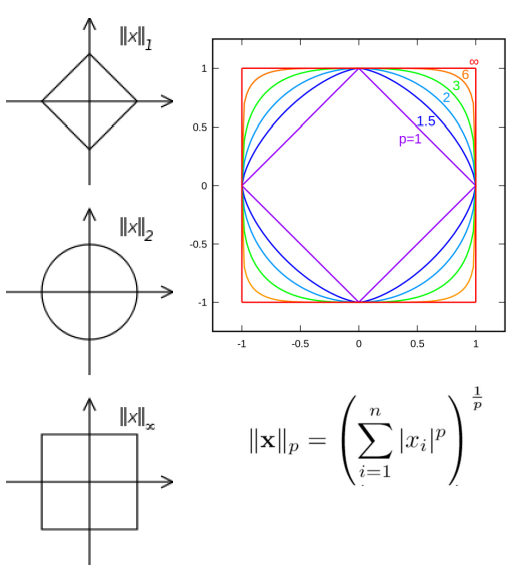

# 2018.03.16日记 #

## SnowFlake算法 ##

上午的时候，看了[Twitter的分布式自增ID算法snowflake (Java版)](https://www.cnblogs.com/relucent/p/4955340.html)和[理解分布式id生成算法SnowFlake](https://segmentfault.com/a/1190000011282426)，感觉snowflake算法也不是特别难。倒是让我想起了公司的base_uid_platform里生成全局用户ID的事情。有时间要把SnowFlake的方法记录成日志。

## 思维导数 ##

今天离职的，也思考了一下接下来时光该做些什么。画成了思维导图，放在了百度里。

## 机器学习 ##

今天看秦曾昌的直播课程《机器学习全新升级版I》，今天是周五，下次上课时间是下周一。

关于内容

首先，讲了函数。从简单函数到复杂函数的一个过渡，其中几个函数的例子有指数函数、对数函数、Sigmoid函数、ReLU函数。然后讲了Function Decomposition(函数分解)，大概意思应该是讲“复合函数”可以进行函数分解来得到“初等函数”（不知道我这里用的“初等函数”名词对不对）。

接着，讲了线性代数。里面的内容挺多的，有向量、向量空间。讲到向量空间的时候，秦曾昌讲了一个例子，说一个四维的球体穿过我们生活的空间时，我们能看到什么。他给出的回答是，先看到一个小点，再看到慢慢变大的球体，再看到慢慢变小的球体，最后变成一个点后消失。我在听这个的时候，忽然意识到，四维球体本身没有变化，而我们看到的球体的像却在不断变化，这并不是球体造成的，而是我们的“视野”造成的，正是自己的视野帮助了自己认知世界，但同时也障碍了自己的认知有更多的突破。

讲了向量、向量空间，又讲向量的模（Norm)，Norm居然是模的意思，RK，要记住啊。又讲了L1-Norm、L2-Norm和L(p)-Norm（p表示一个自然数）；接着又讲了特殊的两个L0-Norm和L-infinity Norm，给出了下面的图，觉得挺有趣的。

当p=1时为L1-Norm，它的开头是最里面的菱形，当p=2时，呈现为圆形，当p走向于无穷大时，呈现为正方形。

又接下来，讲了Matrix（矩阵），讲了向量乘法。

再接下来，讲了Vector到Tensor的过渡。

再接下来，讲了Determinant（行列式），秦曾昌讲了一个知识点我之前不知道的，就是，行列式代表的是面积，自己可以画两个向量试一下。

再后面讲了Eigenvalue（特征值）、Eigenvector（特征向量）。

再后面讲了Singular Value Decomposition（奇异值分解）

再后面讲Jacobian 和Hessian矩阵。

最后，讲凸函数和凹函数。

