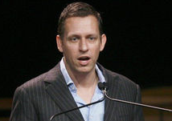

# Peter Thiel #

彼得·蒂尔（Peter Thiel）被誉为**硅谷的天使**，**投资界的思想家**。个人作品有**《从0到1》**。

## 职业生涯 ##

- 1998年创办PayPal并担任CEO，
- 2002年将PayPal以15亿美元出售给eBay，把电子商务带向新纪元。
- 2004年做了首笔在Facebook的外部投资，并担任董事。同年成立软件公司Palantir，服务于国防安全与全球金融领域的数据分析。他成立了蒂尔**奖学金**（Thiel **Fellowship**）鼓励年轻人在校园之外学习和创业。他还成立了蒂尔**基金**（Thiel **Foundation**），推动科技进步和对未来的长远思考。
- 2005年，投资5000万美元创办Founders Fund风险投资公司，致力于扶植Web 2.0公司，曾在2004年为Facebook创始人提供了50万美元的启动资金，而这项投资为其获得**2万倍的收益**。

## 个人作品 ##

彼得·蒂尔在《从0到1》  详细阐述了自己的创业历程与心得，包括如何避免竞争、如何进行垄断、如何发现新的市场。《从0到1》从哲学、历史、经济等多元领域，解读世界运行的脉络，分享商业与未来发展的逻辑。

