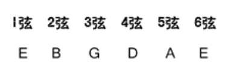
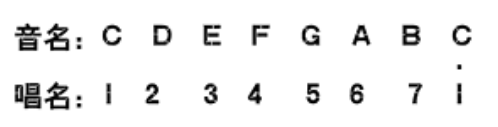
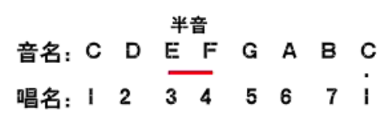
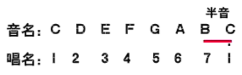
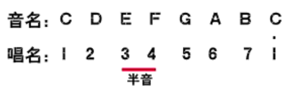
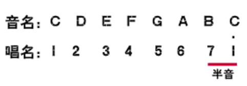

## 001 ##

百度：iTan吉他

淘宝：ITan乐器

官方QQ：523044449

## 002、认识吉他 ##

民谣吉他

吉他的结构：

- 琴头（6个弦钮，调节琴弦松紧，音高也会发生变化）
- 上弦枕
- 琴颈
- 品柱（也叫品丝）
- 固弦钮
- 琴码

吉他的类型：D型、A型、J型、OM型，初学者建议使用D型民谣吉他

D型吉他，标准为41寸

41寸民谣吉他

- 云杉面板
- 电子调音器（琴头调音器）
- 变调夹
- 节拍器（电子节拍器 ziko）
- 琴弦和拨片
- 好的教材
- 好的平台

## 003、如何给吉他调音 ##

**六根琴弦的音高**

**音名和唱名**：

左边低，右边高，低多少呢？用**全、半音**来表示。

半音：

全音：其他的都是**全音**。

半音：就是相邻的品，例如从第1品到第2品；
全音：从第1品到第3品，就是一个全音

**调音的方法**：电子调音器调音，放在琴头

## 005、认识六线谱 ##

- 和弦图
- 右手指法谱（x号标记）
- 简谱 0 1 7
- 歌词

左手按住的和弦

扫弦

扫弦谱

六线谱

和弦图

## 006、七音阶练习 ##

