## 001 ##

百度：iTan吉他

淘宝：ITan乐器

官方QQ：523044449

## 002、认识吉他 ##

民谣吉他

吉他的结构：

- 琴头（6个弦钮，调节琴弦松紧，音高也会发生变化）
- 上弦枕
- 琴颈
- 品柱（也叫品丝）
- 固弦钮
- 琴码

吉他的类型：D型、A型、J型、OM型，初学者建议使用D型民谣吉他

D型吉他，标准为41寸

41寸民谣吉他

- 云杉面板
- 电子调音器（琴头调音器）
- 变调夹
- 节拍器（电子节拍器 ziko）
- 琴弦和拨片
- 好的教材
- 好的平台

## 003、如何给吉他调音 ##

**六根琴弦的音高**

**音名和唱名**：

左边低，右边高，低多少呢？用**全、半音**来表示。

半音：

全音：其他的都是**全音**。

半音：就是相邻的品，例如从第1品到第2品；
全音：从第1品到第3品，就是一个全音

**调音的方法**：电子调音器调音，放在琴头

## 005、认识六线谱 ##

- 和弦图
- 右手指法谱（x号标记）
- 简谱 0 1 7
- 歌词

标准的吉他弹唱谱，如下

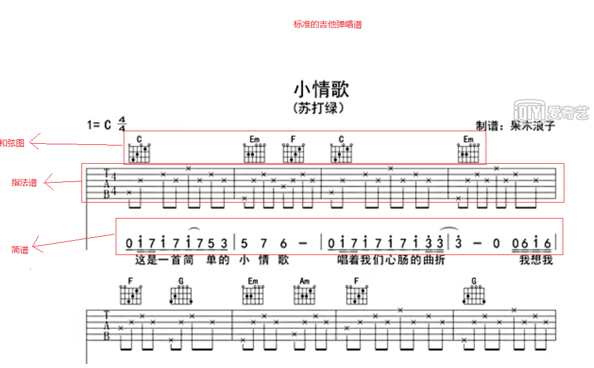

规范的扫弦谱，如下

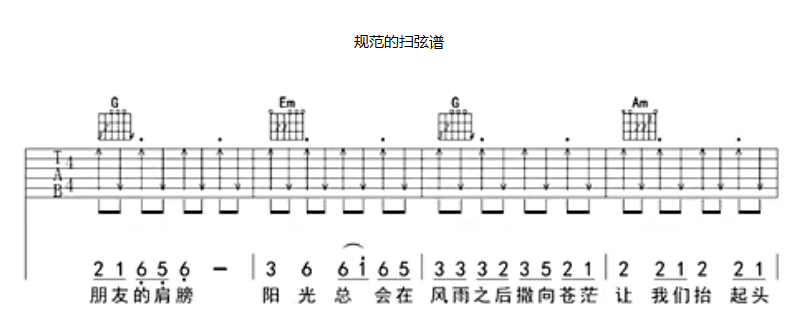

接下来，认识**六线谱**。

6条线代表6个弦

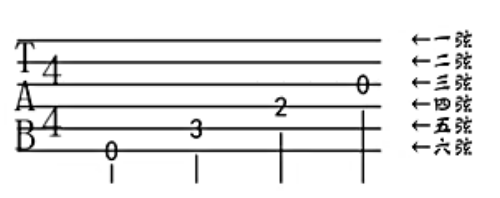

形象展示

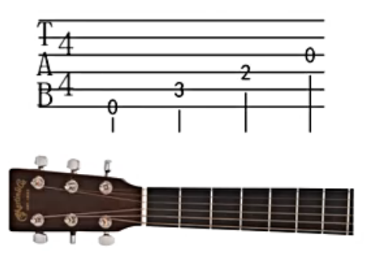

指法谱上的几个数字

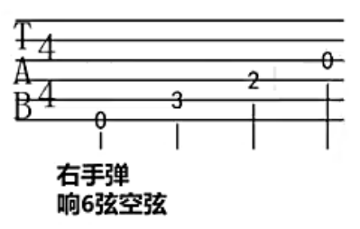

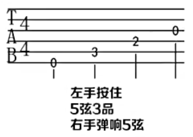

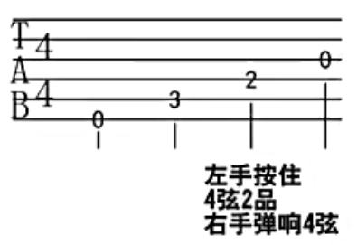

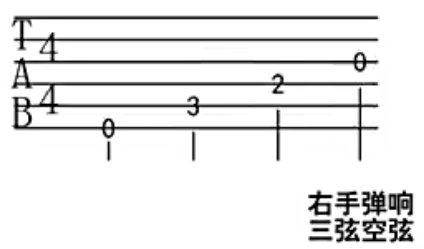

接下来，认识**和弦图**。

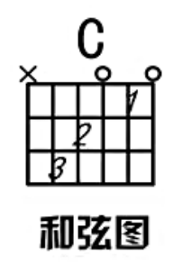

和弦名称

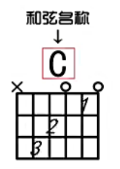

6条线代表6根琴弦

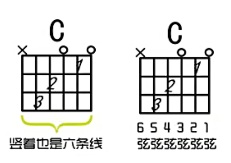

形象展示

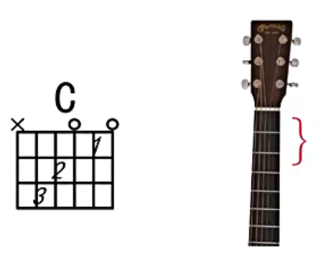

此弦不发出声音

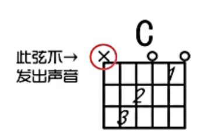

前三品

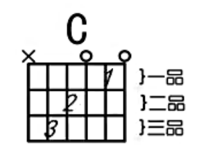

和弦内音（简单的理解，可以忽略这个圆圈）

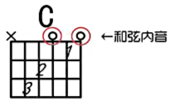

“指法谱”中的“数字”代表几品；
“和弦图”中的“数字”代表左手的代号

左手代号如下：

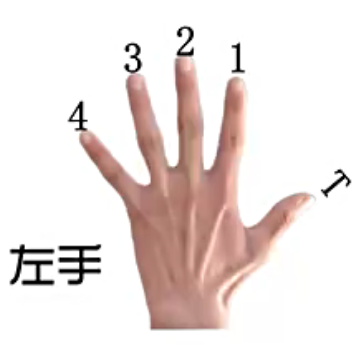

用代号为1的手指放在第2弦的第一品上

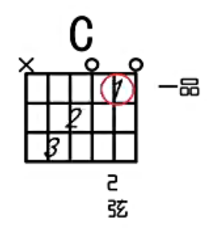

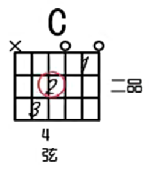

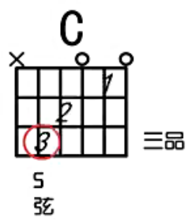

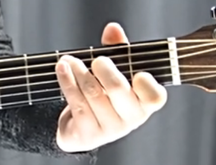

右手代号，如下图

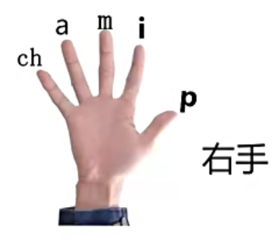

代号为1的手指把6根弦都摁住,这叫做封闭和弦

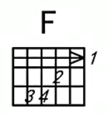

从7品开始

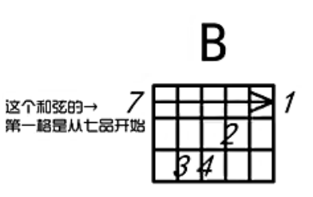

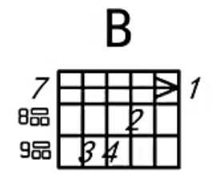

下面这个是和弦图显示了4品（一般是显示3品）

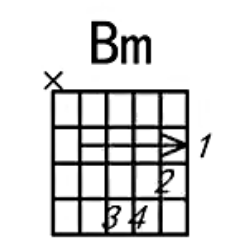

一个弹的示例：

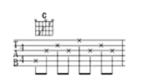

## 006、七音阶练习 ##

