# 架构演进 #

## 1、原笔记 ##

单个网站应用、单个数据库

网站应用的集群：Session共享的问题？有4种解决方案

数据库的集群（主从、读写）
主从数据库的数据不一致怎么解决？用ShardingJDBC可以解决。
MyCat和ShardingJDBC的优缺点是什么

mysql->oracle->mysql

ShardingJDBC的优缺点：

- 优点：统一会话管理，不用担心某台机器挂掉而导致会话丢失，安全
- 缺点：增加机器开销，增加了开发负担和工作量

浏览数写数据库太频繁

sso
binlog

**SSO**英文全称**Single Sign On**，单点登录。SSO是在多个应用系统中，用户只需要登录一次就可以访问所有相互信任的应用系统。它包括可以将这次主要的登录映射到其他应用中用于同一个用户的登录的机制。它是目前比较流行的企业业务整合的解决方案之一。

Mysql的binlog日志作用是用来记录mysql内部增删改等对mysql数据库有更新的内容的记录（对数据库的改动），对数据库的查询select或show等不会被binlog日志记录;主要用于数据库的主从复制以及增量恢复。

redis降低数据库的压力
solr一定程度上也是减轻数据库压力
solr elk

dubbo hsf

数据库存储图片名称、真正图片存在硬盘下

oss(tfs) OSS= Operation Support System，运营支撑系统

http://git.jiagouedu.com/

## 2、整理笔记 ##

- （1）单个Web应用、单个数据库
- （2）Nginx实现多个Web应用构成集群，其中的问题是Session共享
- （3）数据库的集群（主从、读写）：主从数据库的数据不一致怎么解决？用ShardingJDBC可以解决。
- （4）redis/solr一定程度上都缓解数据库的查询压力
- （5）大应用拆分成小应用，微服务
- （6）分库分表
- （7）基础架构：mq消息中间件、redis cluster、search cluster(Solr/ELK)、FastDFS（图片）

一个系统的各个功能组成

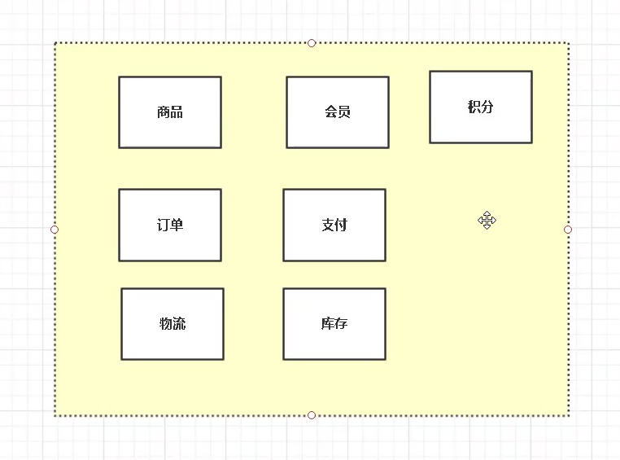

单个Web应用，单个数据库

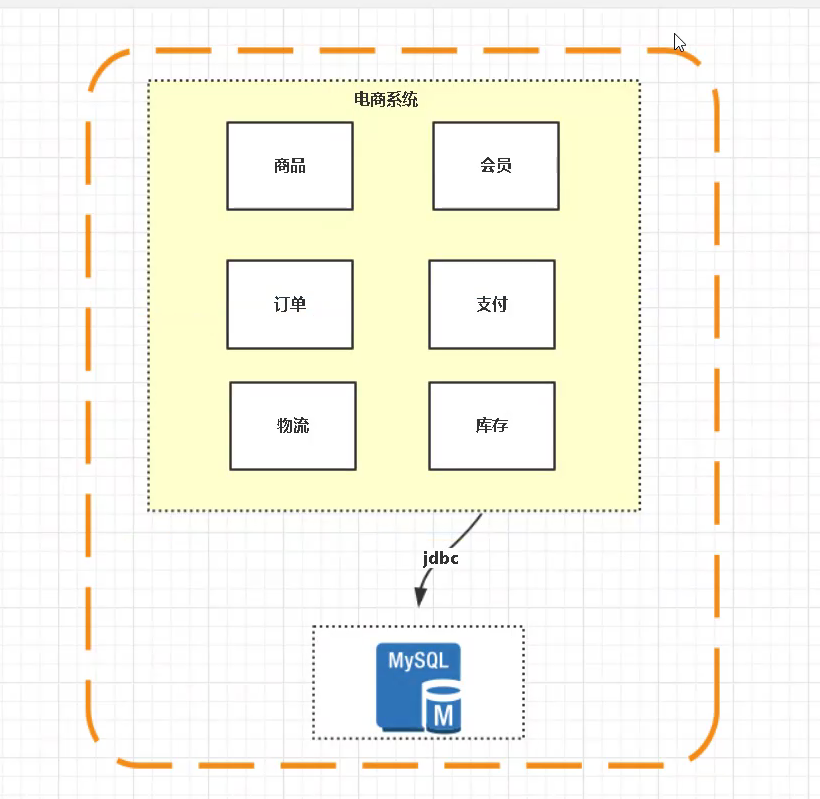

多个Web应用(单个数据库)，借助于Nginx实现负载

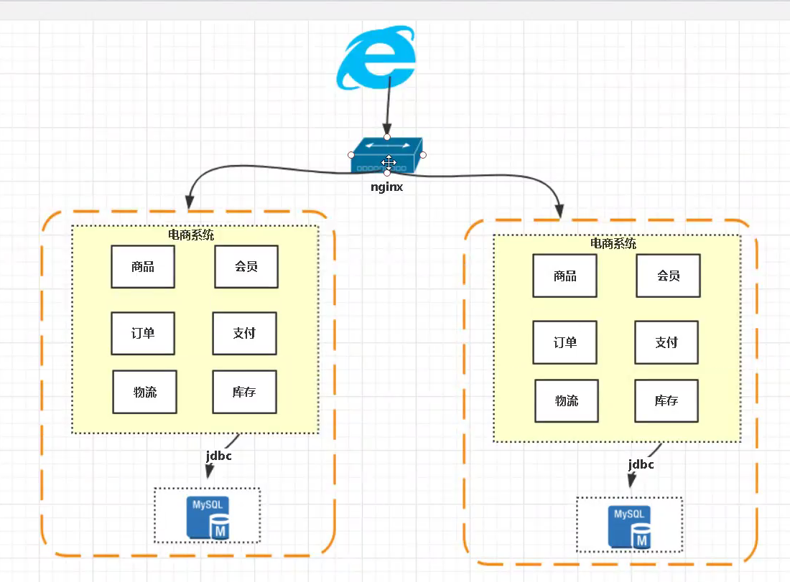

多个Web应用导致的问题就是Session共享的问题：

第一种方案，根据用户ID（abc/ccc)的hash值，导向不同的机器，各个session存储在各个机器上，缺点是万一某一台服务器down机了，该服务器的session就会丢失。

第二种方案，实现两个Web服务器之间的session共享（复制），缺点是：这样会造成资源浪费。

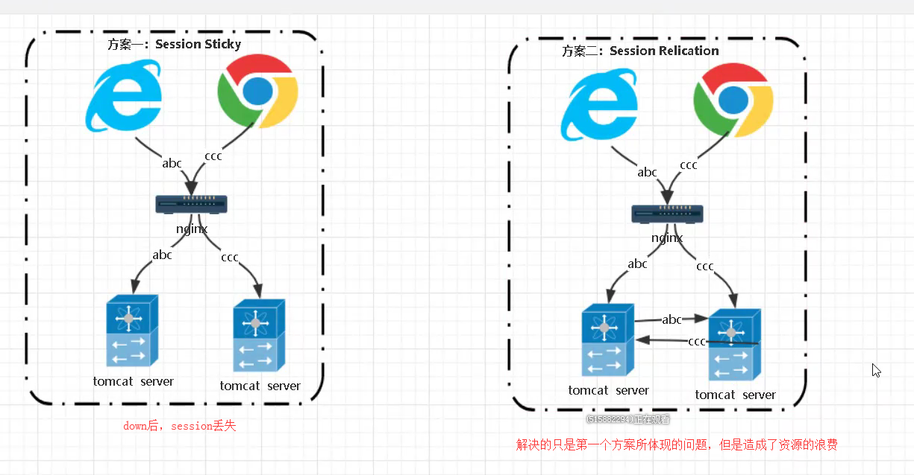

第三种方案，将session信息包含在cookie当中，缺点是这样容易造成cookie被解密、用户信息泄漏

第四种方案，将session信息存在redis等容器中，缺点是增加了redis的维护成本。

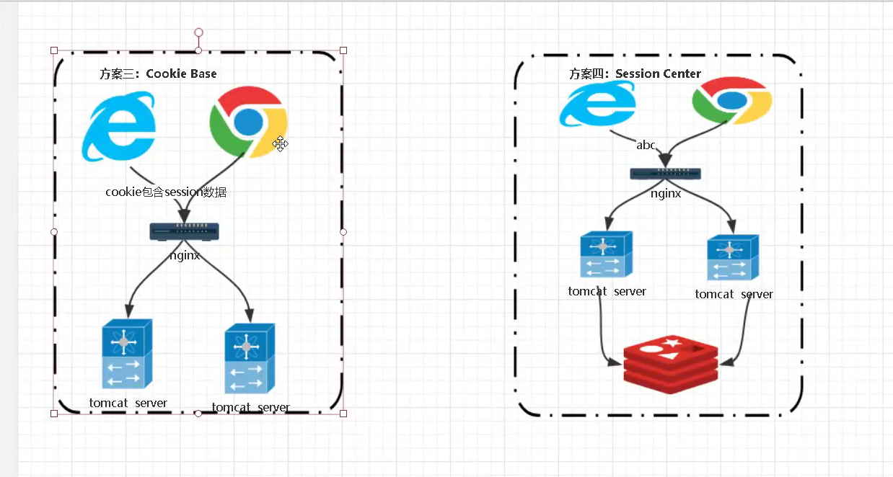

我想到了JWT。

SSO单点登录是云共享的Session，能够实现一次登录，并能访问各个子系统，而不需要重新登录各个子系统。

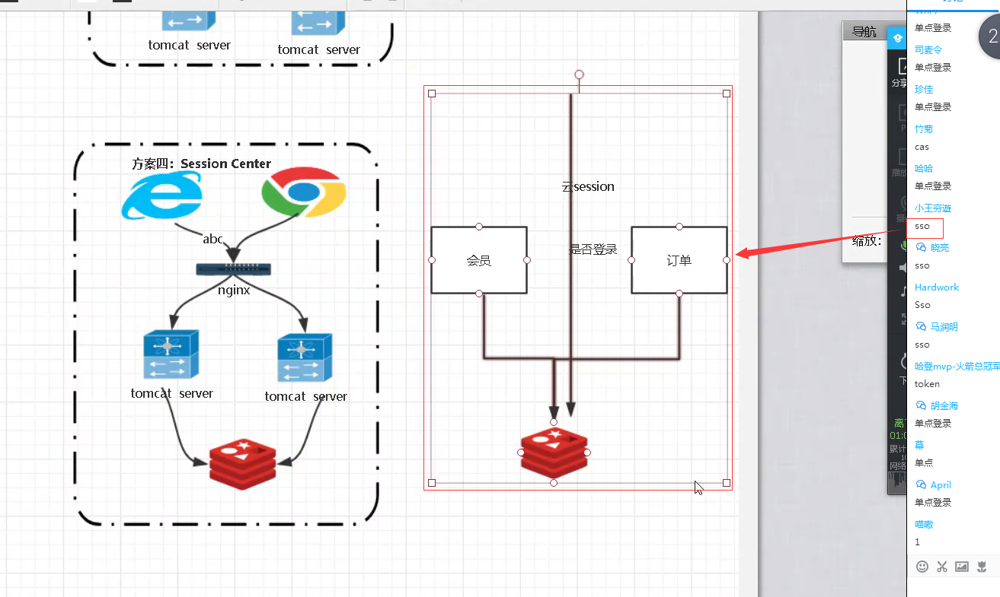

从数据库层面进行改进，进行主从分离（读写分离）

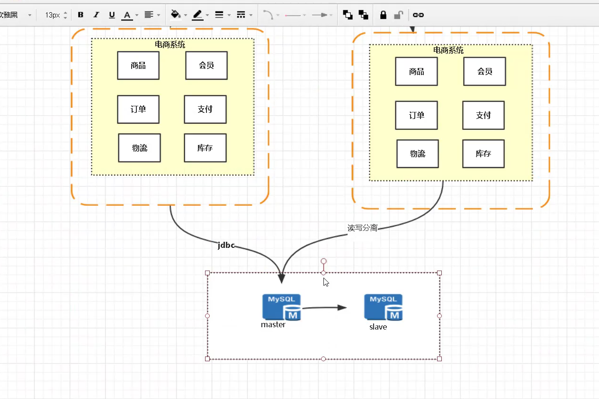

数据库读写分离的两种方式：proxy（代理模式，例如mycat）和应用层（例如shardingjdbc）

在添加新的数据库时，proxy的方式（代理模式，例如mycat），不需要重启应用层的服务器；而应用层（例如shardingjdbc）需要修改配置文件，需要重启服务器。

使用binlog进行主从数据库之间的同步。同时，有一个实际的问题，就是主从可能是有延迟的，刚刚在主库添加的订单数据，需要在从库读出来，但此时从库还没有数据，就会读不到数据。使用shardingjdbc可以解决这样一个问题。

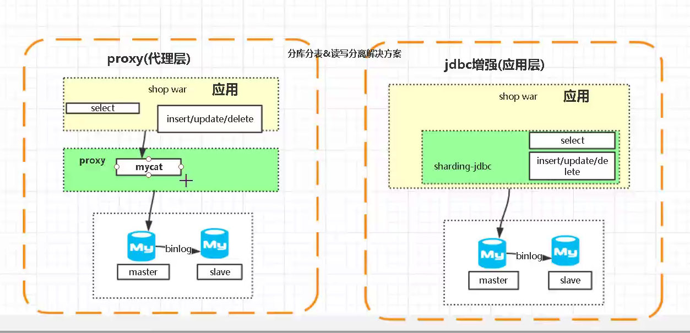

使用主从分离，主要是为了进行读写分离，是为了将“读”从主数据库中抽离出来。search cluster（solr、elk）、redis cluster一定程度上，是为了减轻从数据库“读”的压力。

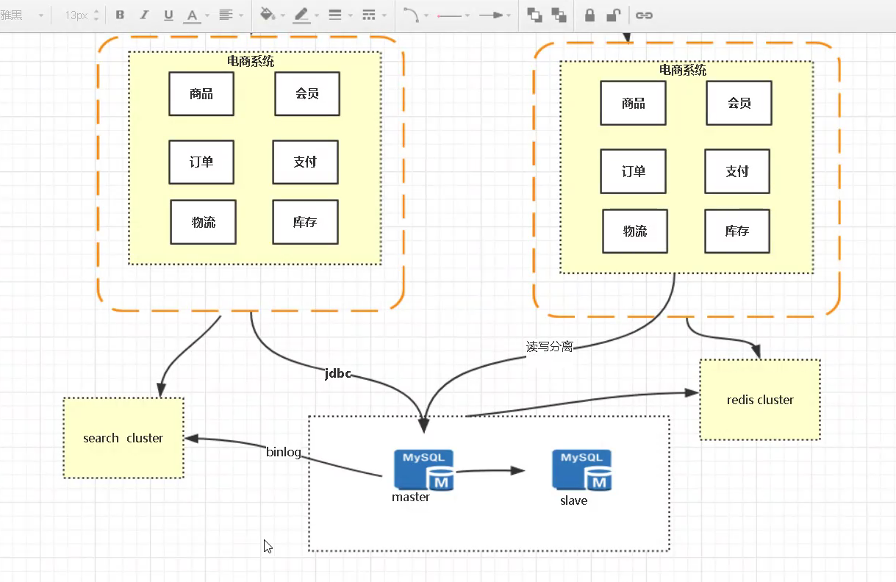

接下来，就是从应用上进行拆分，拆成各个子系统，形成微服务。这里用到的技术可能就有dubbo，spring boot等。服务的治理，要用到spring cloud等。

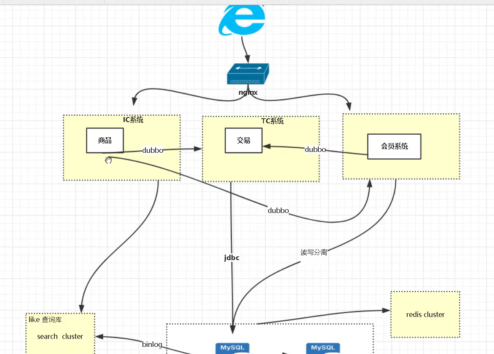

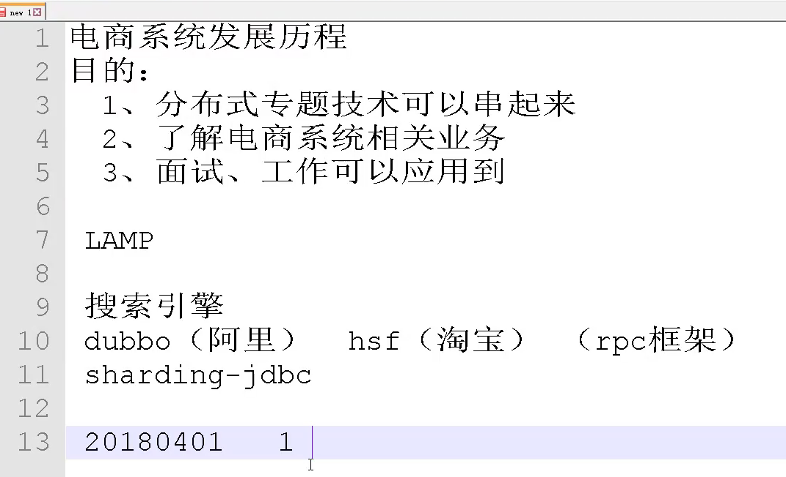

接下来，就是分库分表，以及“基础架构”服务的形成。基础架构中，mq消息中间件的主要特点有两个：解偶、异步。

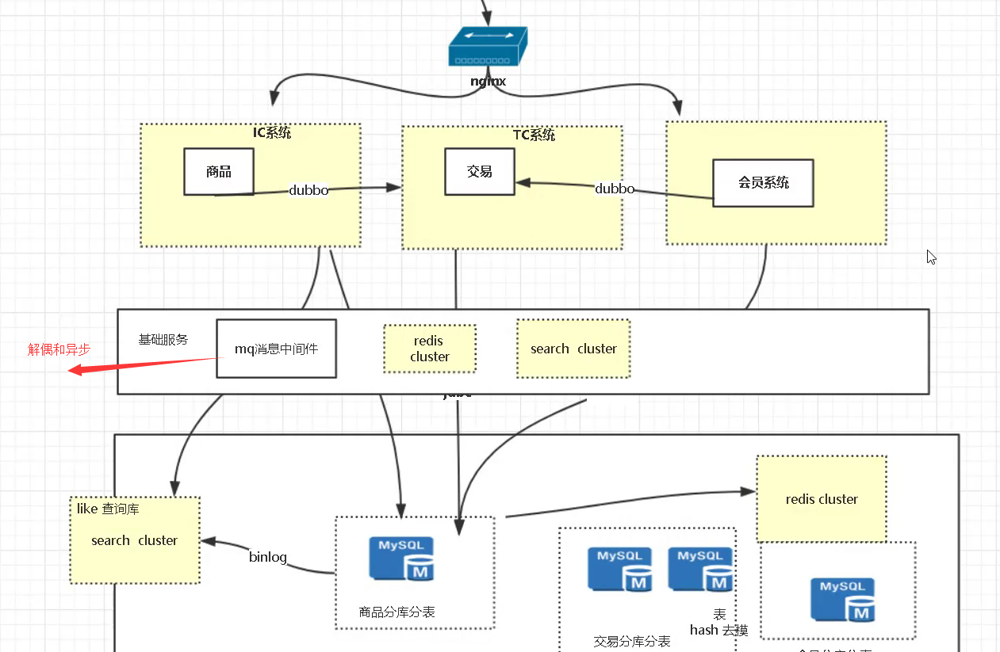

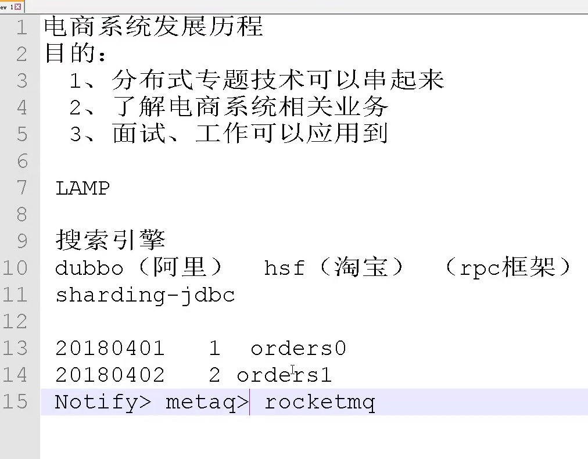

还有就是讲到图片存储的问题。淘宝用的是tfs（taobao File System），一个开源的是FastDFS。

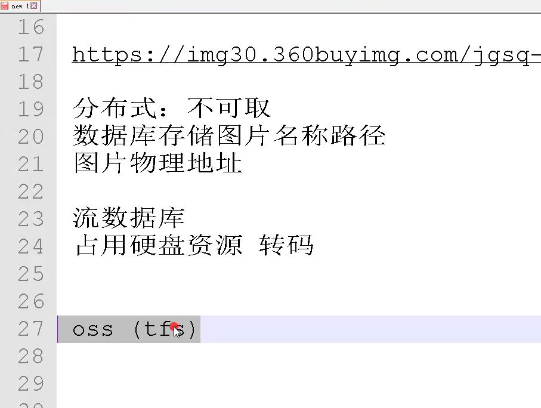

接下来，是一个项目的架构图

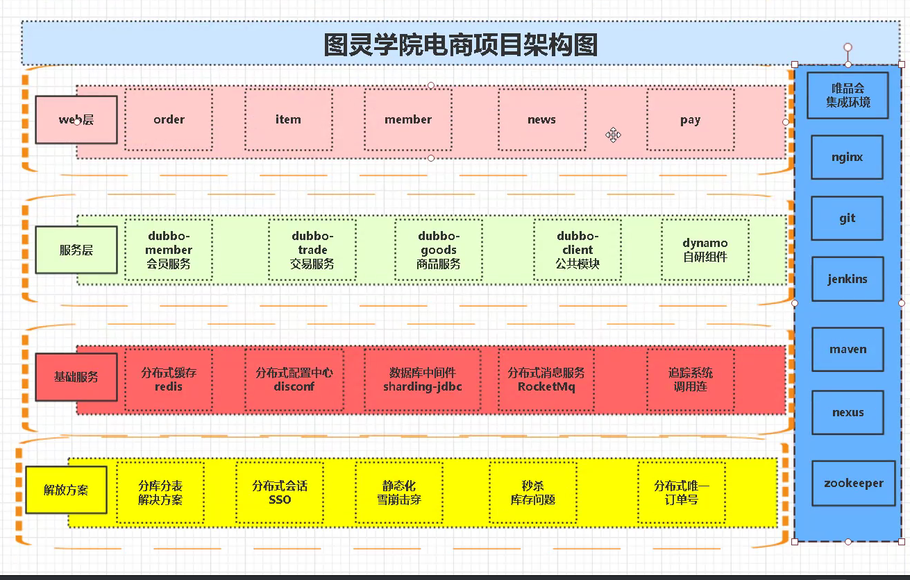

