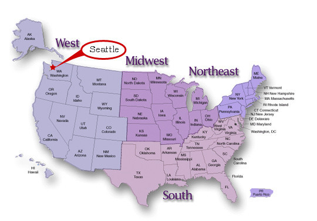
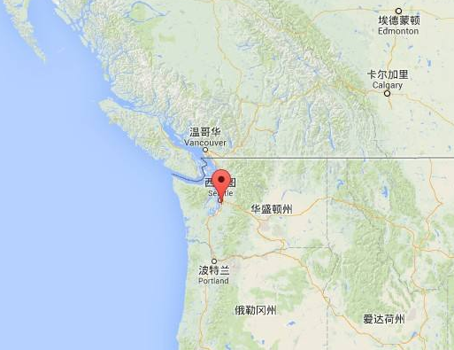

# Seattle #

## 位置 ##

西雅图（Seattle），位于美国**华盛顿州**西北部的**太平洋沿岸**，普吉特海湾和华盛顿湖之间，西临奥林匹克山脉，东临华盛顿湖，城市中心坐标为北纬47°37'35''，西经122°19'59''。该市距离加拿大与美国边境约174千米。

## 评价 ##

1995年，西雅图被《货币》杂志评为“全美最佳居住地”，1996年被《财富》杂志评为“最佳生活工作城市”，1998年被公认为美国生活质量最高的城市。

## 公司 ##

波音、微软、亚马逊、星巴克，这几个公司都有一个特点——垄断。

