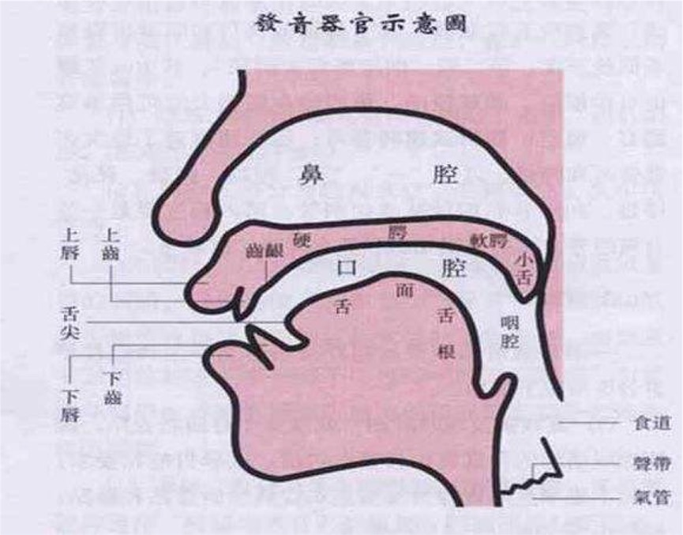
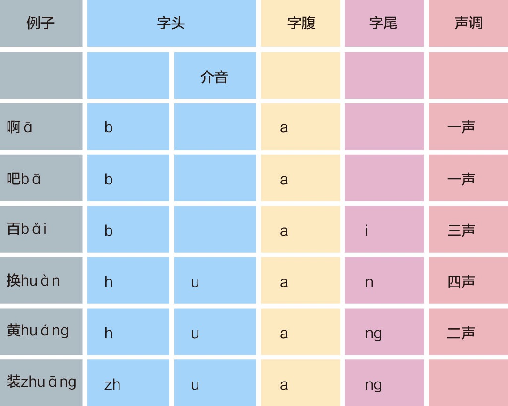
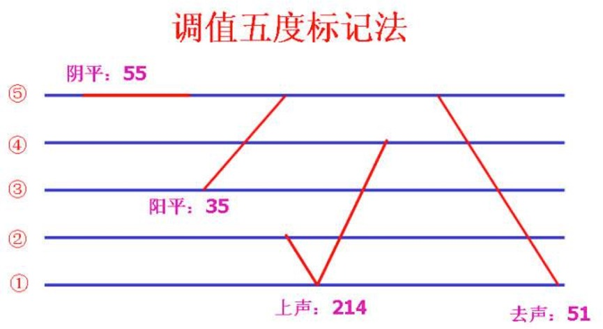

# 怎样让你的声音更有魅力 #

- 什么是好声音：3个小节，也就是好声音的标准是什么
- 如何用声：懒人练声法，帮助你合理的用声
- 吐字：2个小节，吐字的基本规律、难点音
- 整合：发声、吐字的办法加入到日常的表达中；同时，注重“虚实结合、刚柔并济”的原则，这能帮助你在表达中更好的传达感情、说服别人

## 1、什么是好声音 ##

我们总结一下，从这**两个角度**来切入的话，他们有两个共通之处，一个叫做**科学的用声**，第二个叫做**规范的吐字**。在这两个标准的情况之下，我们往往就可以定义一个人的声音属于好声音。

## 2、怎样才能科学用声 ##

在这一节当中我们将具体为您讲解的是科学用声的诀窍和方法。

在讲具体方法之前必须要给您呈现一个口诀：**气息下沉、喉部放松、不僵不挤、声音贯通、字声轻弹、如珠如流、气随情动、声随情走**。我个人总结了这么三句话： **情感是君王，气息是统帅，声音是士兵**。

那么这三者是什么关系？我们为什么要达到这样的三种状态呢？

首先，**情感**是君王。情感是我们在进行语言表达的时候最重要的一个层面，它是最终支配我们的**气息**和我们**声音**的这个归根结底最重要的一个内部力量。但是，这儿我们先不谈**情感**。在我们的**声音**的表达过程当中，要获取好声音，很多人总是在追求最终的这个声音的呈现。

殊不知，比**声音**更重要的还有一个内容，叫做**气息**。当气息一旦被我们调理顺畅之后，声音它是一个自然而然的最终呈现，所以切不可本末倒置。

在这儿，我们怎么样达到那种科学用声的气息，怎么样达到那种能够获取好声音的气息呢？现在我们要讲一讲科学呼吸当中的一个根本大法。这个根本大法听着好像很高大上。但是练起来，没有您想的那么复杂，卸下担子。

接下来就需要您跟着我一块儿来做这么一些动作。

首先，也许您现在很慵懒的躺着，或者说正站着。现在就需要您**找到家里一个硬板凳，然后坐着，把腰杆立起来，整个人处于一个非常放松的状态**。

想象一下，现在春暖花开，在一个公园当中百花齐放，香味沁人心脾。那么我们在闻到这个花香的时候，内心非常的愉悦，我们真想把这个花香吸到肺底。我们共同来做一做，把沁人心脾的花香吸到肺底，吸气。

虽然我没有看到正在听课的您，但是我打这么两针预防针，看看有没有人被我打得着啊。首先，**您在呼吸的时候有没有这样，非常响亮**。其次，您在呼吸的时候**有没有把肩膀突然给耸起来呢**？这两种状态，我们说它都不是科学的状态。如果您以这两种状态来进行呼吸的话，您的气息沉不了、深不了、科学不了。

那我们应该怎么样呢？是要把沁人心脾的花香吸到肺底，但是我们呼吸的时候也不能有声音。吸气，呼吸无声、两肩放松、胸部放松、喉部放松。有没有感觉，也就是我们头颅往下，腹腔往上的这个部位是完全放松的，不给它任何的力量。

在这个时候，气息开始往下走了，我们**要做一个动作**，跟着我做，把您的**手放到我们肚脐以下三指的这个地方**，也就是我们所谓的小腹。然后**用您的手指稍微使点力往里摁，再吸气**。

**闻花香，呼吸无声、两肩放松、胸部放松、气息下沉、小腹微收**。这个地方我们传统上叫丹田，**丹田用力，您的手微微往里摁**。好，在这个时候有没有感觉到有一股力量使得气息很稳健，徐徐的进入到我们肺底了。吸气，呼，吸，呼。记住，无论是吸气还是呼气，都要达到我们肺容量的大概八成或者七成这个感觉，相信大家自己能够感受到。

那接下来您可以做**最后一个动作**了，把**手放到我们的腰的两侧**，我们称之为两肋。有一个成语叫两肋插刀，插的就是这儿。**然后吸气，闻花香、呼吸无声、两肩放松、胸部放松、喉部放松、气息下沉、小腹微收、丹田用力**。好，吸气。

有没有感觉到**在这个时候您的肋部缓缓的把您的双手给撑开了呢？如果有，那很恭喜您，您达到了科学用声的状态**。如果没有，也不要着急。告诉您一个小诀窍，您可以在这个时候躺平了，躺在床上，然后在您的这个腹部放一本比较重的书或者其他重物都可以。然后再呼吸，再把手放在肋部，它是绝对能够打开的。那么您记住这个状态就叫做科学用声的状态。

> 注意：这里是“科学用声的状态”，而不是“科学用声”。
> 如何呼吸

## 3、懒人练声法 ##

这要简单解释一下，**懒人练声法**它并不是为所谓的懒人服务的，而是为像正在听课的您这样的**平时工作比较忙，但是又有志于改善自己声音的朋友们而创立的**。因为我们在上一节当中所讲的**科学用声**的这样一种根本的方法它并不是与生俱来，从娘胎里带出来的，它更多的**是一种后天习得的呼吸的状态**。

那么既然是后天习得，它就**需要我们经常性的进行一种刻意的练习**才能达到这样一种科学用声的状态。而我独创这个懒人练声法，各位看一看，方式和步骤非常简明扼要，**每天可能占用您10分钟的时间，但是日积月累下来，我相信您的声音状态一定能达到一个最佳的状态**。

同时，有了一个**科学用声的状态**，其实我们最终是为了**行之于声**，是为了让我们的声音达到一个更好的状态。而通过这个**懒人练声法**，我们也能够很好的把**声音**和**气息**做一个对接，让我们真正理解**气息如何驾驭声音**，气息这个统帅跟声音这个士兵之间的关系是怎么样的。

来，大家坐直了，同样的，先把自己的**呼吸调匀，呼吸无声、两肩放松、胸部放松、喉部放松、气息下沉、小腹微收、丹田用力、两肋打开**。请大家自己自如的把刚才这套根本大法，**呼吸吐纳三次**。

在呼吸完了之后，跟着我来发第一个声，这是懒人练声法的第一个音，也是一个非常基础的音。1、2、3，a——。

刚才我们发了一个基础的音“a”音。这个**“a”音**应该说是我们**普通话音韵系统当中一个最基础的音，而且它大量的出现在我们的各种音节当中**。

那么发这个音的时候您要注意，首先要**保证喉部处于一个完全放松的状态**，也就是咱们不能给它任何外力。其次要注意把我们刚才**通过呼吸根本方法所吸进去的那八成满的气完全的呼出来，完全的就着这个“a”音把它徐徐、稳健、有力的从我们的肺底呼出来**。

我们再来找一遍这个状态，吸气，1、2、3，a——。好！我相信有很多的朋友他可以呼吸的更长，这是一件很好的事情。这个**“a”音**，有没有发觉它是我们整个声音范围当中处于中间的一个**中音**。那我们在日常说话的时候，往往就是以这个音域来说话的。**用这个音域说话会让人觉得很舒服，会放松了戒备**。

那么我们再来发第二个音。这第二个音相对于刚才这个“a”音它要**更低一点**。是一个什么样的音呢？

先别忙，把刚才呼吸的状态再来一遍。**吸气，八成满。同样，缓缓地，徐徐地把它从肺底都呼出来**。1、2、3，u——。在这个时候您把您的手放在胸口，有没有感觉到胸口在微微的震动，在进行共鸣？这个音很明显，它是一个低音，它是在我们音域当中那个比较低的部分。

发这个“u”音的时候也有一个好处，就是在您平时如果说了一天话，很累了，那你发一发这个“u”，您会发觉我的声带好像被按摩了一样，很舒服，这是一个小诀窍。 
发完这两个音之后，第三个音，我相信很多朋友都已经猜出来了，它就是一个**高音**。这个高音在发的时候需要我们相对的更加用力一些，气息也要更强一些，所以对于我们在控制气息的时候要求就更高了。各位可以先听我发一遍，感受一下这是一种什么状态。

吸气，1、2、3，i——。好，有没有感受到这个音比刚才“a”和“u”明显的要高出一个八度。那么，这非常明显的叫做**高音**。

我相信在生活当中有很多喜欢K歌的朋友们，其实在歌厅当中，在KTV点了一首自己喜欢的歌，然后开始唱。尤其是那些没有经过训练的朋友，他也会达到自己高音的状态，或者说低音的状态。

但是，您在歌厅所发的那个高音或者低音跟我们刚才所发的并不是一个概念。它**最大的不同点**在于**刚才的高音和低音它完全处于我们控制的范围当中，完全是在我们气息驾驭的范畴之内**。而很多朋友在歌厅当中所进行的高音和低音的诠释是完全已经超出了他个人控制的范围，所以在那种情况之下，您在第二天声音可能会嘶哑，可能会变得不健康。

所以，通过对于**声音的驾驭**，通过**气息**很好的来调节**声音**，我们能感觉到无论是**中音**、**低音**还是**高音**，它都是我们**在一个自如的范围当中去进行控制的，也只有在自如范围当中可以有效的驾驭它**，我们才能够真正达到**声音、情感，以及气息之间的统一**，我们的表达才能让别人觉得舒服。

发完这三个音之后，我们还有**四个简单的绕口令**。关于这四个绕口令对于我们练习的作用，我们在下一节当中会为各位详细的讲解，在这儿您只需要跟着我先把它读一遍。

首先，我们来感受一下第一个绕口令。大家跟我读一遍。“**八百标兵奔北坡，炮兵并排北边跑。炮兵怕把标兵碰，标兵怕碰炮兵炮**”。有没有感觉到，在这个时候您的**上唇**和**下唇**在很有力的触碰，发出了这个绕口令。好，您自己读一到两遍。

我们再来看下一个绕口令，在这个时候感觉到我们的**舌头开始活动起来**了。“**调到敌岛打特盗，特盗太刁投短刀，挡推顶打短刀掉，踏盗得刀盗打倒**”。很有趣的一个绕口令。有没有感觉，这个时候我们的**舌尖**开始在口腔当中有力的运用起来了。

我们再来看下一个绕口令。大家跟我读一遍。“**七加一，七减一，加完减完等于几。七加一，七减一，加完减完还是七**”。在这个时候，我们的**舌头的中间的部分开始有力的动起来了**。

我们再来看最后一个绕口令。“**哥挎瓜筐过宽沟，赶快过沟看怪狗，光看怪狗瓜筐扣，瓜滚筐空哥怪狗**”。同样很诙谐很幽默的一个绕口令，在这个时候**舌头的最后这个部分**，也就是**舌根这个部分也开始活动起来**了。

有没有发觉，读完这四个绕口令，您的**口腔瞬间变得更灵活**了。

说到这儿，我们简要的总结一下这一节。在这一节当中，首先为各位**节约时间**，我就独创了一个**懒人练声法**。这个练声法分别从**高音、中音和低音**三个角度来**驾驭我们的这个声音的状态**。我为各位示范了**四个绕口令**，这四个绕口令练完之后，可以让我们的口腔变得更加灵活。如果你每天能够花十到十五分钟来练习刚才这个方法，我相信日积月累，您一定会在声音上得到一个很好的锻炼。

那么，刚才提到了一个小小的悬念，这**四个绕口令**它对我们**吐字**有什么样的作用，为什么练完它之后，我们的口腔会变得更灵活呢？下一节当中我们会具体讲解。

## 4、怎样发准一个音 ##

在这一节当中，我们将具体为您讲解我们怎么样来**发准一个音**。

我们稍微回溯一下之前的内容。在最开始的时候，我们就提到过，**好声音它的基本的标准有两点**：第一点叫**科学的用声**，这一点我们在之前的内容当中已经论述过了。而接下来我们要讲的就是第二点，叫**规范的吐字**。**规范的吐字是我们达成好声音的必由之路**。

在讲解如何发准一个音之前，我们需要简单的认识一下我们在**吐字时候的几个发音器官**。简单的来讲，它分别是我们的**唇部、齿部、颚部以及舌部**。我们的**口唇、牙齿、上颚，以及我们的舌部**。这些部分之间会进行有机的联动，最终呈现出一个又一个我们的汉语普通话当中的音。

比如说当我们**双唇**进行触碰的时候会发出**b、p、m**这三个音。您可以跟着我发一遍，双唇有力的触碰，发出b、p、m。再往里一点，我们的**上齿**跟我们的**下唇**进行触碰，会发出一个很亲切的音，**f**。

好，再往里，我们的舌头就要开始作用了。当我们的**舌头**跟我们的**上齿**背触碰的时候，就会发出**z、c、s**。当然了，也有朋友是用舌尖和下齿背触碰的，都可以。只要能发出z、c、s这组音都对。

好，我们的**舌尖**稍微抬起来一点点，跟我们的**上牙龈**触碰发出一组什么音呢？**d、t、n、l**。同样的，非常的亲切，每天我们在发微信的时候都会用到的。

把**舌尖再往上抬一点**，会发出一组普通话当中非常特殊的音，**zh、ch、sh、r**，这组**翘舌音**。可能很多南方的朋友可能会觉得陌生一点了。

然后我们再发出一组音，各位来看看它是哪跟哪触碰发出来的，**j、q、x**。有没有发觉，同样是发**zh、ch、sh、r**的上颚前部的这个部分，我们称之为**硬颚**，但并不是舌尖跟它触碰了，而是**舌头的中段**跟它触碰，我们称之为舌面发出这个**j、q、x**。

我们再来看，舌头最后的这个部分，我们称之为**舌根**。舌根的这个部分和上颚的最后的这个部分，我们称之为**软颚**，它们俩触碰能发出什么音呢？**g、k、h**。

那说到这儿，咱们相当于把汉语拼音方案当中，我们在小学时候学过的那些关于声母的部分都回忆了一遍。其实除了声母之外，我们要发准一个音它还有别的几个部分需要我们去做到位。在这儿呢，请大家看这样的一个音：bai。我们请一个小伙伴先来发一下这个音，发完之后，请各位自己思考一下他发的怎么样。

好的，我相信您在听完之后感觉跟我是一样的，哎呀，怎么好像不太标准啊。那么它究竟哪儿不够标准呢？我们就要来分析一下这个音如果标准的发应该怎么发。

我们看到，这个音看似很简单，“百”这个字，但在发音的时候其实我们要做**四项工作，有四个步骤**，没有那么简单。**首先，我们简单地把这个音做一个切分，它有它的头部，同时有它的腹部，最后好像还有一个尾巴**。那么我们可以分别将其称之为**字头、字腹以及字尾**，一个字的头部、字的腹部以及字的尾巴。

在发这三个部位的时候有一个讲解，**发字头的时候我们要把它叼住**，各位听我发这个音，叼住。当我发叼的时候有没有一种用力的感觉，对，就是叼住字头。b，b，而不是简单的b，这就没有叼住字头了。

其次，我们要**把这个腹部尽量的拉开**，**把这个“a”音发得尽量的饱满**。那如果这个“a”音发得不够饱满，这个腹部没有拉开就会出现刚才这位小伙伴所读的，bai，bai，这个“a”就显得很扁，在很多的方言区都有这个问题。各位仔细听一听我们亲爱的罗胖老师他就有这个问题，他的这个方言语调当中发“a”音，字腹就没有拉开，各位下次看到他就可以说了。

第三，我们**在发字尾的时候**，大家要记住，一定记住它，**不要把它丢掉了**。比如说我们刚才小伙伴在读的时候就读成了bai，bai。那最后这个“i”不翼而飞了。那加上这个“i”它的发音应该是什么样的呢？bai，bai。各位，听，最后有没有一个“i”的动作呢？我们的舌头得往前再伸一伸。
把这三步都做到位了，并没有大功告成，因为还有一个部分，这个部分在我们的汉语普通话当中应该说是特有的一个部分，那就是**声调**。

其实在西方的很多语言当中是没有声调的，尤其是世界第一语言——英语，有了声调的普通话就像音乐那样好听，所以俄国作家高尔基曾经就提到过，只有优美的歌声才能够和中国的汉语相媲美。那么我们要做的就是**把声调发到位**，bai，bai。好，那这样一来，这个三声就算是发到位了。

其实除了三声之外，我们都知道**普通话有四个声调**，还有一声、二声和四声，**无论我们碰到哪一个声调，我们都要把它发到位**。这个声调对于我们个人来讲其实就是我们相对的一个音高，其实它也有非常科学的一个总结，如果您想详细了解，我为您准备了这么一张图，叫做**五度标记法**，它是由清华大学赵元任先生创制的，它可以让您很清晰的看到这些音发饱满应该达到什么样的调值。

要发准一个音大概要做到**这四个步骤**，也只有做好了这四个步骤，一个音才算是发音到位。**首先我们要把字头给叼住了，得有力。其次要把字腹给拉开了，得饱满。第三，要把字尾给收住了，也就是说不能让它丢掉，不能让它不翼而飞。第四，我们要让调值饱满**。我们来看看那张图，看看所谓的五度标记法，你就能理解什么叫做调值了。

我们简单回顾一下这一节的内容，这一节主要告诉我们，首先我们有这样**几个简单的发音部位**，它分别是我们的**口唇、牙齿、上颚、以及我们的舌部**。其次，这些**发音部位之间联动起来之后能够发出不同的声母**，我们的汉语拼音方案当中那些声母就是这样发出来的。第三，就想让各位了解的是**发准一个音**没有那么简单，它**有四个步骤，缺一不可**。当我们把这四个步骤都做到了之后，您就可以说自己在进行规范的吐字了。

> 总结：
> （1）介绍各个发音器官
> （2）用发音器官组合去发几个简单的音
> （3）如何发准一个音

## 5、快速改善你的地方口音 ##

在之前我们**懒人练声法**当中所用的**几个绕口令**的作用，在接下来您就会越来越明了了。绕口令它可以用一种非常诙谐幽默的方式把我们想练习的那些难点音归结为一个又一个的专题，那我们只要练习这些经济、有效而又有趣的一些片段其实就能很好的治愈我们的这个普通话当中的一些缺陷。

我们再来看一看，在汉语普通话当中大概会用哪些音是比较难发的呢？我总结一下，您也对号入座，看有没有您的病灶。

比如说，**平翘舌音**，z、c、s、zh、ch、sh、r。我相信，在中国绝大多数方言区的朋友们都可能会有这个病灶。再比如说**前后鼻音**，in、ing、an、ang、en、eng，在这个时候，我相信您一拍大腿说，我有这个问题呀。

我们再来看下面这组音，f、h，福建的朋友们有没有这个问题呢？我们很多福建一带的朋友发f、h的时候，有的时候让人觉得会很有意思。我之前有这么一位同学，他在读一个很著名的人物的时候让我们觉得很不解，这个人物叫虎妞，《骆驼祥子》当中的一个人物。

可是，在他嘴里就变成了fuliu，fuliu。那么他不光f、h不分。他同时引出了我们下一个难点音，就是n、l，那么我相信湖南、湖北、四川一带的朋友在这个时候就会对号入座了。而最后一组音j、q、x，我相信有很多女性朋友会有一些问题。

我们开始讲解如何来解决这些问题。

我们首先来看**平翘舌音**，z、c、s和zh、ch、sh、r，它们之间拼合起来应该怎么发，我们用什么样的一句话可以把它们都囊括在内进行练习呢？请大家看这一句话。也请大家在我读完之后，跟着我的范读来练一遍。“**出租车司机驶出租车，送此住宿人找住宿证**”。大家只要像我刚才这样一慢一快一慢一快练习三到五遍，这条我们就可以过了。

我们仔细看一看，这个里面的每一个字它都囊括了**z、c、s**以及**zh、ch、sh、r**每一个音，所以说您只要把这一句话翻来倒去的多读几遍，相当于把**平翘舌音**就反复的练习了。而当有一天您读这句话可以读到滚瓜烂熟，没有任何障碍的时候，其实这组音已经得到一个有效的缓解了。

我们再来看下一组音，就是我们的前后鼻音。前后鼻音刚才说过了，**前鼻音**有**in、en、an**这三个音，**后鼻音**有**ing、eng、ang**这三个音。同样的，接下来我来进行范读，一慢一快，大家在我范读完了之后跟读。**身生亲母亲，谨请您就寝，安宁娘身心，拳拳儿郎心**。好，我们再快速的读一遍。身生亲母亲，谨请您就寝，安宁娘身心，拳拳儿郎心。同样的，请大家读三到五遍。

我们再来看下一组，刚才说了福建的朋友们可能会有些问题，f、h。这个绕口令两句话，同样的很经典，我们先慢速的来一遍。**黑化肥挥发发灰会花飞，灰化肥挥发发黑会飞花**。好，我们再快速来一遍，黑化肥挥发发灰会花飞，灰化肥挥发发黑会飞花。同样的，也是对于f、h有问题的朋友们将这一个绕口令练到滚瓜烂熟，我相信您的f、h一定会得到一个有效的解决。因为它本身并不难辨析。

我们再来看下一组音。下一组音关于n、l的这组音，我们很多湖南、湖北、四川一带的朋友们可能会有问题。同样一个绕口令，各位跟着我先慢读一遍。**牛郎年年恋刘娘，刘娘连连念牛郎**。我们再快速来一遍，牛郎年年恋刘娘，刘娘连连念牛郎。很有趣，很经典的这么两句绕口令。

那我们在发n、l的时候，其实我也知道有很多朋友真是冥顽不化，怎么也改不过来。这有个小窍门，你记住。发n音的时候您把手放在鼻头的这个位置会发觉，您的鼻子是震动的，发l音的时候您的鼻子是不震动的。同样的，你把鼻子捏起来，当捏着鼻子能发出来的我们就称之为l音，而捏着鼻子发不出来的就一定是n音。用这个小窍门您再进行辨析，然后加上绕口令，希望您早日治愈。

我们再来看最后一组难点音。这组音就是我们的舌面跟我们的上颚的前部，我们称之为硬颚触碰发出的音，j、q、x，那这组音很多小姑娘，尤其是北京地区的小姑娘总是容易出现问题。出现什么问题呢？她就是容易发成尖音。什么叫尖音？比如说j、q、x，这样发出来就不够规范了。同样，两句绕口令，我们来进行一个有效的练习。

我先慢读一遍，请大家跟读。**七巷漆匠偷了西巷锡匠的锡，西巷锡匠拿了七巷漆匠的漆**。慢速练习的时候您可以尽量的**做一个夸张的练习**，**把每个音发得非常的饱满**，那么这样有助于您进行一个更加有效的夯实。我们再快速来一遍，七巷漆匠偷了西巷锡匠的锡，西巷锡匠拿了七巷漆匠的漆。

到这儿这样五组难点音我们就通过绕口令的方式为您讲解了一遍。建议您在每天花10分钟的时间把这些绕口令，无非就是五句话或者十句话都能够反过头来的读一遍。如果有一些音您可能没有问题，您也可以略过，就重点练习那组您有问题的音，我相信您应该会像罗老师一样在不久的将来就有效的达到一个进步的。

## 6、怎样表达才能说服别人 ##

在这一节当中我们就要**学以致用**了。

对。在此之前，我们已经把**科学的用声**和**规范的吐字**进行了一个简明扼要的讲解。如果您已经掌握了这两条腿开始走路的时候，您就会发觉**无论是科学用声还是规范的吐字，归根结底就是为了我们日常的表达。这个表达可以是日常跟人说话，也可以是我们进行朗读、朗诵。总之，就是一种声音的外在表现，这种表现力的大小可以直接决定您的人格魅力，个人的气质**。

那么如何进行有效的表达呢？如何让您的好声音在表达当中能够让别人觉得赏心悦目呢？有八个字：**虚实结合、刚柔相济**。

什么叫虚实结合、刚柔相济呢？我们简要解释一下，首先我们在用声的时候，在用气的时候，比如说我发实声那是这个声音，而我发虚声，就是这样的一个声音。当我虚实声结合在一起的时候，您就会发觉，您的声音瞬间有了一种审美的抒情的这样一种意境出现了。

还记不记得在之前我所说过的**情感是君王，气息是统帅，声音是士兵**。**情感这个君王如何被烘托出来，就是要通过虚实结合，刚柔相济的这种表达理念才能把这个君王把他给抬出来。当这个君王出现之后，气息马上就会接到君王的指令，然后跟随着君王的号令去统领这个千军万马**。

那么**气息**如何统领千军万马呢？那就是我们在**发虚实声时候气息送的多还是送的少**。**当气息送的比较多的时候，我们在发音的时候就是这样的，是一种虚声。而当气息送的比较少的时候，我们在发音的时候就是这样的，就是比较实的**。也就是说，我们最直接有效的去传递这位君王发出的指令的方法就是**送气的多和少**。

我相信很多朋友在日常生活当中并没有这样的习惯，那么希望正在听这节课的您从现在开始养成这种虚实结合的习惯。

说到这儿，可能还是抽象。我们为您准备了一段文字。好，我们先请一位小伙伴给我们范读一遍：“**真正的忘记并非不再想起，而是偶尔想起心中却不再有涟漪**”。

听完刚才这位小伙伴的朗读，我们会发觉其实他的用声相对还是比较科学的，他的吐字感觉也比较规范。但是，我们总觉得好像少了点什么。他好像没有很好的能够打动我们，为什么？就是因为他在表达的时候没有做到虚实结合，没有做到应该有的一些停顿。

大家再来听一遍我的朗读，我们来做一个对比。**真正的忘记并非不在想起，而是偶然想起心中却不再有涟漪**。好，我已经为您把虚实以及该停顿的地方标记出来了，您就可以根据我做的这个标记来进行一番练习。

我们简要地回顾一下。第一句话我们是以一种偏实声的方式来进行表达的，那刚才说了，偏实声的话我们送气就要送的少，“真正的忘记”。好，第二句，我们把它切分为了两个部分，“并非不再”和“想起”中间有了一个小小的停顿。那么前半部分“并非不再”这四个字同样偏实一些，送气少一些，“想起”偏虚一些，送气多一些。

我们再来读一遍。并非不再想起，大家听，这样一来，声音的层次感立马就出现了。而我们如果只是用一种声音，用一个语调去读的话，那这种层次感是不会彰显出来的。我们接着往下看，下一句话我个人感觉总体用一种虚声来处理会更加的抒情，“而是偶尔想起”，您看，送气比较多。这种抒情的感觉马上就显现出来了。

最后一句话，同样实声虚声结合在一起，把它分成三个部分。三个部分中间有一个小小的停顿，“心中”有一个小停顿，“却不再有”再有一个小停顿，这两个地方都以实声为主进行表达。而最后“涟漪”以虚声做一个结尾，感觉余音绕梁，意味深长。好，我来范读一遍。心中却不再有涟漪。

那么可能您要问了，在生活当中我们也可以这样去表达吗？当然可以。在生活当中，尤其是在和陌生人的初次见面，这种交际的场合当中，我们来进行这样的表达其实很多时候事半功倍。

我们先来讲一讲，在日常交流的时候，我们大概要达到的**三个基本原则**。这三个原则我们概括一下。

第一个原则叫做**合作的原则**，**跟任何人说话都一定要抱着一种合作的态度**。在您的生活当中一定会有这种让您特别反感的人，就是无论您说什么，他在接下来都会说一些带刺的话，或者来挑您的不是，或者去彰显他比您更强，这种人他在交际当中没有两级就肯定会死。

我们再来说第二个原则，**夸奖的原则、赞美的原则**。**对您交流的对象一定要带着一双慧眼去看到他的优点，然后用您的语言去赞美他的优点。任何人都是有虚荣心的，任何人都渴望被夸奖，被赞美。所以说当您以一种合作的态度总是去夸奖对方，他一定会喜欢您**。

再说第三个原则，这就是**谦逊的原则。不光要赞美对方，而且对自己一定不能太自信了，要表现出一种谦虚。要使对方很尊贵，很尊重他，使自己谦卑**。

所以，**合作的原则、夸奖的原则和谦逊的原则**，这三个原则就构成了我们进行日常交流时候基本话术的这样的基本原则。

我相信正在听课的您肯定知道该说些什么。但是该说什么确定之后，如何去说其实很多时候会更加重要。在这个时候，那八个字：**虚实结合，刚柔相济**又浮出水面了。

我们来想一想，**当我们表现出一种合作，一种夸奖对方的这种态势的时候**，那您的声音是更实一些好呢？还是更虚一些好？尤其是您还要表现出自身的谦逊，卑己尊人的时候，您的声音是更实还是更虚呢？

**当我们夹杂一些虚声的时候会让一个陌生人瞬间放下戒备，会让他觉得他真的在夸我，他不是在奉承我，他不是对我有所图谋**。所以大家看到，这个虚实结合的方式在用到我们日常说话的时候是多么有效。

我们总结一下。这一节主要就是想为您传递我们在进行学以致用的过程当中，行之于声的过程当中做到这么一个原则，叫**虚实结合、刚柔相济，让您的声音有层次，有变化**。我们为您列举了日常交际当中三个话术的原则：**合作的原则、夸奖的原则和谦逊的原则，这都可以让您的语言使对方很受用，很舒服**。

然后就是**怎么样去表达这样的语言会让对方觉得更加放松，更加舒服**。如果您可以在日常生活当中都贯穿了这样的原则的话，我相信您在任何交际场合一定会立于不败之地，无往而不胜。

## 7、总结 ##

您好！到这儿我们要讲解的知识点就告一段落了。下面请允许我为您进行一个梳理和回顾。

在第一节当中，首先为您讲解了**好声音的两个标准**，它们分别是**科学的用声**和**规范的吐字**。这也是我们在接下来要具体达到的两个重要的目标。

接下来我们跟您讲解了科学用声能够为您带来什么，同样是两点，请您自行回顾。

再下一节当中，我为您讲解了**科学用声**它**基本的一些诀窍和基本的方法**，相信您应该记忆犹新。在这儿我再提醒一句话， **情感是君王、气息是统帅、声音是士兵**。

再下一节，为了帮您节约时间，我们用了一种非常简明扼要、行之有效的锻炼气息和声音的方法，叫做懒人练声法。那么这个**懒人练声法**同样有两部分组成，也希望您能够持之以恒、每天练习。

再下一节我们具体讲解了应该**如何去发准一个字音**，发音时候有哪些部位，哪些部位是需要互相联动的。我们也以bai这个音作为案例，为您讲解了发准这个音时候需要做的四个步骤。

接下来的一节我们为您列举了这样一些**难点音**，包括平翘舌音、前后鼻音、f、h、n、l，以及舌面音。而我们同时为了帮您节约时间，用了一种非常行之有效，已经被罗胖老师证明了的有效果的训练方式，那就是绕口令，希望您能够跟随这些绕口令每天花时间进行练习。

下一节当中我们具体为您讲解的是在**日常表达当中的一个原则**，叫做**虚实结合、刚柔相济**。只有虚实结合了，您的声音才是真正有层次的。

再下一节当中具体为您讲解了**三种语言表达时候的基本原则**。那么这三个原则同样要通过虚实结合、刚柔相济的总原则去进行表达，这才能让您的表达变得很走心，让您在交际当中立于不败之地。

在日常交流当中我们只要奉行了规范的吐字，科学的用声，以及虚实结合、刚柔相济的表达样态，那么您将总是能够达到一种让您比较满意的交际效果。

在最后我有一番肺腑之言想跟您倾诉。我从事播音主持专业已经十多年的时间了，在这十多年的时间当中，我自己由一个方言区的南方人渐渐登堂入室，开始语言表达的教学。

我自己深知一点，那就是跟语言表达相关的任何理论它本身都只是纸面文章。如果您不进行练习的话，一切都只是空谈。所以要真正习得我们刚才所讲解的这些原则和方法的话，它需要您实实在在的付出时间。

时间也不用太多，我给您一个简要的公式，(5 + 5 + 5) × 365 = 准专业。什么意思呢？每天进行**5分钟的科学用声方法**的基本练习，再加上**5分钟的懒人练声法的基本练习**，再加上**5分钟这些难点音、绕口令的基本的练习**。这5 + 5 + 5天天坚持乘以365，我相信在一年之后您一定会感谢一年之前那个不言放弃的自己。

最后，恭喜您又学了一个新技能！同时祝愿您能够早日的精进自己的语言表达能力。

