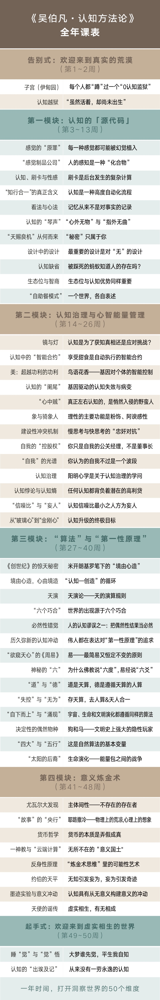

# 2018.04 #

以前，我一直以为，

没有人告诉我，

## 2018.04.11 ##

### 今日得到 ###

**梦与高维度**

以前，我一直以为，XXX。我经常把梦境当成真实，而忘了自己的本心。

没有人告诉我，XXX。我应该为真正的自己努力。

当你身处一个场景，你肯定要奋斗，要做判断，要做改变，但是，你别忘了一个前提：你现在的身体，到底是在梦里，还是在现实当中呢？如果你是在梦里，那是在梦的哪一个层级里呢？

否则，你的所有行为都是忘记大前提的行为，当你忘记大前提的时候，就无所谓对错了。

**假如你生活在一个完全虚假的世界里，你的所有认知，连同你的行为都是虚妄的。**

庄子是中国思想史和文学史上最早提出这个问题的人。
说到庄子，我们就想到了梦——“庄周梦蝶”。庄子做了一个梦，梦见了蝴蝶，他的第一反应是：到底是蝴蝶梦见了我，还是我梦见了蝴蝶？到底是我在一个梦里见到了蝴蝶，还是我只是蝴蝶梦境里的一个虚幻的存在？

《红楼梦》里说“反认他乡为故乡”，中国还有一句诗“梦里不知身是客”。当我们是一个流浪者、一个漂泊者，我们在梦里的时候，是意识不到我们是一个流浪者、漂泊者的。

苏格拉底说，“我唯一知道的就是我不知道，而你们也不知道，但是你们不知道自己不知道。”

这说的其实是一个梦的隐喻：虽然我的身体在一个虚幻的世界，但是我知道这是一个虚幻的世界——这就是**你的认知比别人高一个维度的标志**。而我们普通人都是身在一个虚幻的世界而不自知，反认为这个虚幻的世界是一个真实的世界。

你生活在一个假世界里，觉得眼前的“花柳繁华地，温柔富贵乡”是一个真实的世界，那你就错了。

德鲁克说“**世界上最没有效率的事情，就是以最高的效率去做一件根本不值得做的事情**”，这句话里隐含着认知的重要性。

IBM的前CEO郭士纳在回忆如何把IBM从破产边缘拉回来的时候说过，他做过几件正确的事情，其中有一件事情非常关键，就是大胆地结束昨天的战争。他发现IBM当时做的事情是在打一场昨天的战争，或者说是在打一场已经结束的战争。

什么是“昨天的战争”呢？就是这个趋势已经发生了，悄悄转变了，而你还没有意识到，还在一个过时的产业上要取得优势。这种状况，我对它的说法就是“在泰坦尼克号上争头等舱”。这是一件很悲剧的事情，同时也是一个很容易犯的错误。原因在于，当我们已经置身于泰坦尼克号，我们的目标只在这艘船上，而不知道这艘船正在沉。

郭士纳说的“要大胆结束昨天的战争”，其实也就是他看到了他所处的这个产业，以及IBM正在做的事情是一件虚假的事情，所以他没有把宝贵的资源浪费在逐渐虚幻、消失的一个行业上，或者说，他的洞察力使他能够避免“在泰坦尼克号上争头等舱”。

我记得木心有一句名言“我悲哀地看着你们这群不知道悲哀的人们。”这里可能包含着一个高维和低维的问题——我们所说的梦的世界和非梦的世界其实是不同维度的世界。

## 2018.04.10 ##

### 今日得到 ###

**自在和自由的区别**

以前，我一直以为，自由==自由。

没有人告诉我，**自由就是什么都要由你自己来干，你自己来认知，你自己做选择、做决策、做判断，而且你要承担这个选择和判断的后果，这才是自由**。自在是独自占有一个快乐的空间，不需要思考，不需要选择。

区别：**自在和自由**

说到这里，我要给大家区分两个概念：**自在和自由**。我们经常把这两个词连在一起说“自由自在”，但自由跟自在是很不一样的。

**在子宫、母体、伊甸园的状态下，是“自在”：你独自占有一个快乐的空间，不需要思考，不需要选择，你只是一个附庸，一个微不足道的终端，一切的事务都全权委托给那个母体了。**

什么东西都由不得你自己，这不是自由的吗？不是。“自在”是你自己在那儿，甚至你连自己都没有，就像我们的某个器官，它显然不会有它的自我意识。

**那自由是什么呢？自由就是什么都要由你自己来干，你自己来认知，你自己做选择、做决策、做判断，而且你要承担这个选择和判断的后果，这才是自由。**

自由说起来很好听，但实际上自由是有代价的，代价就是当你的自我建立起来的时候，你要承担种种的责任。

## 2018.04.09 ##

### 今日得到 ###

**奋斗与挣扎**

以前，我一直以为，奋斗和挣扎是两个完全不同的概念，两者（奋斗和挣扎）对应的**行为模式**也能很明显的区分出来。

没有人告诉我，原来我所以为的、称之为“奋斗”的行为很可能只是“挣扎”。“奋斗”和“挣扎”行为的不同之处在于，“挣扎”只是有目标，而没有实际的方法（途径）去达成这个目标，所以一切过程中的“奋斗”都成了无结果的“努力”。 “奋斗”和“挣扎”是人外在的行为表现，而促使人产生行为的必然要源于心中的某种动机，这个动机就是“焦虑感”。换句话说，焦虑感，成为挣扎的趋动力。由焦虑驱动的挣扎，其特点是局部、节点的方向感汇聚成整体的混沌，众多的矢量之和趋近于零。焦虑感是一种变质的紧迫感。紧迫感的特点是面对重大的挑战迅速确定清晰的目标，然后将目标分解为方法和流程，紧张而有序地解决一个个阶段性问题，遇到阻力快速试错，直到实现目标。紧迫感最大的特点是保持“**操之在我**”的心智状态，不给恐慌和怨怼留任何空间。

以后，我要尝试将焦虑感转化成紧迫感，将挣扎转换为奋斗。

**外在行为改变与内在原则改变**

以前，我一直以为，自己进行某种的改变，只是从外在行为上多加注意。久而久之，原来的问题总是不断的出现。

没有人告诉我，人的作为、境遇都不过是心性品质自内而外同步的结果。我是一切问题的根源。

以后，我要在发现自己行为不对的时候，深入内心，找出问题，在内心的原则上做改变。

**认知舒适区和认知微创伤**

以前，我一直以为，学习让自己思维感受到困难时，自己就不想学了。

没有人告诉我，学习让自己思维感受到困难时，正是原有的认知受到“微创伤”的时刻，是一个惊喜的时刻，是一个成长的机会。这其实离开了自己原有认知的“舒适区”，只有突破认知的舒适区，才能在认知上有所成长。

以后，我要（心情上）欢喜，同时要打起精神来。

### 奋斗和挣扎有什么区别？ ###

“你说很多的奋斗其实是挣扎，那挣扎和奋斗的区别到底是什么？”——《伯凡日知录》有一个同学这样问我。

我的回答是，所谓“挣扎”，就是有目标、无方法，自然也是无结果的努力。

回答这个问题的时候，我脑子里自然想到了一些耳熟能详的名言——“以不断的努力证明自己永远不会成功”，“永远在做同一件事，却一直盼望有不一样的结果”。

还是得重复一个老生常谈：**焦虑感是一种变质的紧迫感**。

紧迫感的特点是面对重大的挑战迅速确定清晰的目标，然后将目标分解为方法和流程，紧张而有序地解决一个个阶段性问题，遇到阻力快速试错，直到实现目标。

**紧迫感最大的特点是保持“操之在我”的心智状态，不给恐慌和怨怼留任何空间。**

**而由焦虑驱动的挣扎，其特点是局部、节点的方向感汇聚成整体的混沌，众多的矢量之和趋近于零。**

我们很容易堕入挣扎的状态，因为我们知道事不宜迟，知道不努力的后果，所以我们选择了快速、直接、看上去有用的应对方式，既节省时间又不用费脑子，最重要的是，这种让自己觉得自己在努力的状态，多多少少地缓解了我们的焦虑和恐慌。

**“唯恐错过”是焦虑的典型征候。**

我们不放过眼前任何“或许什么时候管用”的新机会、新信息、新知识。

比如我们不停地刷手机，看到本来就是冲着你的焦虑和恐慌来的标题、广告，按捺不住想看、想收藏、想购买的心情。持续地囤积，在囤积中获得一种暂时的安稳感，正在成为我们奋斗的新常态。

囤积本来是人的一种由来已久的冲动。

“女人的衣柜里永远缺一件衣服”，这是深得广大女性心仪的一句老话。与这句老话相对应的是一个显而易见的事实：满满的衣柜里很难找到一件在关键时候能穿得出去的衣服。面对一柜子你说不清什么时候买的、什么时候穿过的衣服，一种破产和归零的感觉会油然而生。

每一次买衣服的时候你都想“搞点新意思”，你自以为别出心裁地买了一件全新风格的衣服，但在别人眼中，那不过是从你衣柜里随手拿出来的一件。

原因很简单：
**无数个0加起来还是0，0的巨量累积不可能实现从0到1的突破**。

### 真正的改变只发生在原则里 ###

“同步”（Synchronization）现在已经是一个常见的技术概念了，我们不会想到这是一个宗教和哲学概念。

一些哲学和宗教流派认为：**人的作为、境遇都不过是心性品质自内而外同步的结果**——如同使用iTunes将电脑里存储、编辑好的内容同步到iPhone手机上，也如用QQ同步助手将存储在云端的通信录同步到新手机上，新手机立即在相当程度上变成了你原来的手机。

你买到的新衣服之所以是一件“旧”衣服，原因是，你的购买行为其实是一种“同步化”的行为，当你出手购物时，存储在你大脑中的标准、趣味和习惯就一股脑地“同步”到你的“新欢”中——你所有的“新欢”都不过是“旧爱”。

达利奥的《原则》未言明的的核心理念之一就是同步。

他说，**真正的改变只能发生在原则层面**。

**人的思维、行为和表达方式都受制于蕴含其中的原则，在你的原则没有发生实质性进化的情况下，你能改变的——无论是内在外在——都微乎其微**。

很多人长期以来的工作和生活之所以是无意义的重复，是因为他们从未改变、优化他们的原则，甚至从未反省过一直在驱使着自己的思维和行为的底层代码是怎样的。

你生活、工作着就是在犯着错误，都在经历着痛苦，即使你看上去已经很成功。犯错误是人的宿命，人与人的差别只是犯错误的方式的差别。

**世界上只有两种人，“正确地犯错误”的人和“错误地犯错误”的人。**

前者总是能够持续地以X光般的反省方法获知自己行为原则中的Bug，持续地消除Bug，优化原则，实现原则性进化。后者则总是自觉无辜地犯错误，从来不与自己的简陋、粗劣的原则打照面。

说到这里，大家可能对挣扎和奋斗的本质区别更加清楚了。

鲁迅说，人与人的差别有时候要大于人与猿的差别，对于人的认知，也可作如是观。

### 认知的“微创伤” ###

我们往往不自知地成了认知的留级生，尽管看上去是努力地升级并且觉得自己已经升级了。

升级、进化、蜕变，总是伴随着巨大的痛苦。消遣自娱式、不触及原则的努力无法让人实现“从猿到人”的进化。

有一年回老家与一位长辈闲聊时，谈起了我自己小时候一些可爱的愚痴。他说，有一次他看到我一手拿着镜子，一手不停在镜子后边想要抓什么东西。

大笑之余，我意识到，幼小的我内心一定经历了一次小小的“认知地震”，或者经历了一次认知的“微创伤”。

我们从小就不断经历着类似的事情。

当我们看到烧水壶时就要伸手去摸，结果被烫得哇哇大哭；看到筷子在盛水碗里里“变弯”了，我们百思不得其解……

正是这些“小地震”“微创伤”，促成了我们在认知上的进化。因为它们动摇、伤及了我们已经形成并且一直在管用的原则。

所谓“认知地震”，指的是你原有的、看似稳固的认知，由于某个事件或场景遭致坍塌。

**而认知的升级，就是在认知废墟上重建认知。**

我们多数人幸运又不幸地让自己的认知停留在了非地震带上，停留在子宫般温暖、宁静的“认知的故乡”，用安兰德的话说，我们虽然活着，但尚未出生。

在这一季的课程里，我试图要做的，就是与同学们在认知上持续地经历种种“微创伤”。

我们不仅要拥有自己的知识账本，还需要有一种严格地给自己做知识审计的习惯。

我和大家每天都在自己的知识日记里记下一页，上半页是：“**以前，我一直以为，……**”，下半页写着“**没有人告诉我，……**”

### 落魄不堪的自我放逐 ###

中国有句老话，叫：“一语惊醒梦中人”。

读哲学史的时候，也经常会看到相似的话，比如康德说：“休谟把我从独断论的迷梦中惊醒过来。” 电影《黑客帝国》中，莫菲斯船长对尼奥说：“你不从梦中醒来，又怎么知道你是在梦中？ ”

**只有当我们真正懂得一件事情后，才知道自己当初有多么不懂。**

当然，认知的升级最有效的方法之一是“休克疗法”——在认知上经历一场足以让自己落魄不堪的放逐。你熟悉的一切突然消失，你突然在异常陌生的知识处境中遇见了倍感陌生的自己。

在知识市场上，没有人来为我们做**精神食粮的FDA**（食品药品监督局），除了我们自己——尽可能让自己少吃高热量、低营养、重口味的东西，多吃一些低热量、高营养、口味清淡的食品，让自己在认知上少一些虚胖，多一些健美。

**德鲁克说，我们常常高估一年的变化，而低估五年十年的变化，原因是我们常常忘了“复利”的存在。**

一年时间，我不敢高估更不敢向你承诺突飞猛进的变化。但我相信，一年时间，五十个课题，其中也许包含着小小的认知复利，这小小的复利，足以让我们一起自我刷新。

当然，任何人都不能让别人代替自己经历自己的人生，实现认知的升级。真正的认知升级，一定要由本人经历许多真真切切的事故，这些事故的积累成为了一个人的认知故事。任何人不能代替我们自己去经历这些事故。

但在这里，我们可以做一件事，**通过读书，以一种旁观者的身份去进行一场知识历险**。

我们重新看一看历史上发生过的那些认知事故，以比较简略的方式去还原那些认知故事。

