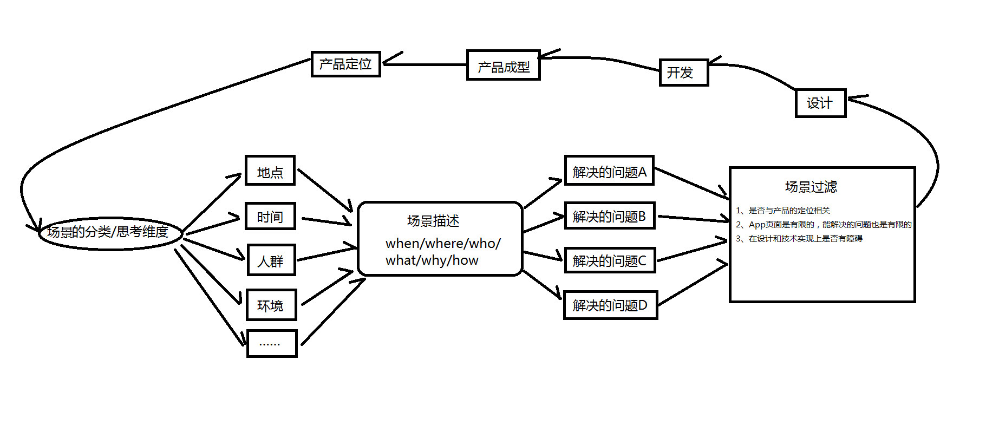

一个App解决的场景是有限的，不是无限扩展的；
场景的分类维度，在不同的业务下是不一样的：蹲坑的时候刷微博、在上下班路上刷微博；

场景，使用App的可能性。可能性的分类维度：地点、时间、环境、背景、人群、思想状态等。

场景在一定的条理性的基础上符合逻辑性，要存在现实可以搭建成功的可能，

好的场景不会单凭自主意识，比如不单会表达一个人在XX状态想满足YY需求用了ZZ产品，还会关注他人的参与感，激发同理心，主动幻想搭建甚至传播。

根据用户的习惯去构建场景，也可以构建场景引导用户的习惯。

场景的描述：6何分析法（when/where/who/what/why/how)，时间+空间+动作就可以描述用户行为，但你描述这些的时候，其实你就是在描述场景。

你解决了问题，用户对你的情感会累积的。场景也不是坐在办公室凭空想，得去跑调研。

学习梯度

find the right way,而不是lost in the resource sea.

简单的说，就两点吧：
1、用户在什么情况下会使用这产品，使用中会出现哪些可能性，这些“可能性”又会发生哪些状况
2、你这么设计的目的是什么，可以解决用户使用产品中哪些问题。

要从产品定位开始发散性场景，分类规划场景属性，细分核心场景添加相应功能。

要发散，要收回。

